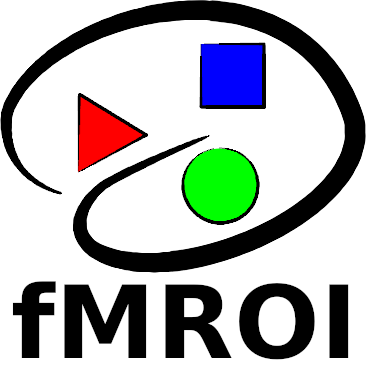

# fMROI Supplementary Data

## Overview

Welcome to the "fmroi_supplementary_data" repository! This repository contains a collection of scripts and datasets used in the study *"fMROI: A Flexible Toolbox for ROI Design and Functional Connectome Analysis"*. It provides the necessary resources to reproduce and validate the full ROI-to-ROI processing pipeline, including ROI generation, BOLD signal extraction and cleaning, functional connectome computation, and classification using support vector machines (SVM). The repository also includes tools for benchmarking ROI creation against established neuroimaging software.

## Contents

### ROI Dataset

- `./roi_dataset`: Contains all the templates used in the evaluation tests of the ROI creation algorithms, as well as all the ROIs created by each of the tested algorithms;
  - afni-dataset.zip: Spherical, Cubic, Img2mask, Clustering, and Drawing ROIs;
  - fmroi-dataset.zip: Spherical, Cubic, Img2mask, MaxK, Clustering, Regiongrowing, and Drawing ROIs;
  - fsl-dataset.zip: Spherical, Cubic, Img2mask, and Drawing ROIs;
  - MRIcroGLmricrongl-dataset.zip: Spherical, Img2mask, and Drawing ROIs;
  - spm-dataset.zip: Spherical, Cubic, and Img2mask ROIs;
  - test_data.zip: Real and synthetic data used in the original study. See Methods section 3.7 "Testing with real and simulated data" for details.

  
The parameters for creating ROIs are described in their file names. The first two terms represent the software and the algorithm used for ROI creation. The remaining parameters are preceded by flags:

- `srcimg`: Source image - image used as a template to create the ROI;
  - `spheres`: 64-spheres.nii.gz;
  - `syndata`: complex-shapes.nii.gz;
  - `dmn`: default_mode_association-test_z_FDR_0.01.nii.gz;
  - `dmnnoise`: default_mode_association-test_z_FDR_0.01_gaussnoise_5db.nii.gz;
  - `t1`: T1.nii.gz.

- `premask`: Mask applied to the source image before ROI creation, restricting the analysis to this region only:
  - `aparcaseg`: aparc+aseg_2mm.nii.gz;
  - `cone`: premask-sphere_cone_radius_15_center_x46y84z58.nii.gz;
  - `tetra`: premask-sphere_tetra_radius_09_center_x47y61z56.nii.gz;
  - `lhpc`: premask-sphere_lhpc_radius_08_center_x58y57z27.nii.gz;
  - `rhpc`: premask-sphere_rhpc_radius_08_center_x33y57z27.nii.gz.

- `premaskidx`: Index of the region from the aparc+aseg (FreeSurfer) atlas used as a premask;
- `radius`: radius of the spherical mask in voxels;
- `edge`: Size of the edge of the cubic mask in voxels;
- `kvox`: Defines the number of voxels in the ROIs generated by the maxk algorithm, i.e., the k voxels with the highest intensity;
- `center`: Center of mass of the spherical or cubic mask in data matrix coordinate (RAS, LAS, LIA, etc.);
- `threshold`: A pair of values representing the minimum (minT) and maximum threshold (maxT). It sets to zero those voxels with values lower than minT or greater than maxT: thresholded_image = srcvol >= minT & srcvol <= maxT. In fMROI, if minT is greater than maxT, it sets to zero those voxels with values simultaneously lower than minT and greater than maxT: thresholded_image = srcvol >= minT | srcvol <= maxT;
- `mincsz`: Minimum cluster size, clusters with fewer elements than mincsz are eliminated;
- `cluster`: Index of a cluster generated for a given set of parameters;
- `target`: Target region used as a template to draw an ROI. Here, the only target was the left hemisphere hippocampus (lhpc) from the synthetic image complex-shapes.nii.gz.
- `user`: Subject who drew the ROI;
- `seed`: Index of the starting position for the region-growing algorithm. In Matlab, the index can be converted to three-dimensional coordinates using the command [x,y,z] = ind2sub(size(srcvol),seed);
- `diffratio`: The maximum magnitude difference of the neighborhood with respect to the seed, i.e.: |neighbor_mag - seed_mag| =< |diffratio|;
- `grwmode`: Defines the growing mode:
  - `ascending`: searches for the neighbor with the maximum value at each iteration;
  - `descending`: searches for the neighbor with the minimum value at each iteration;
  - `similarity`: searches for the neighbor with the most similar value to the seed;
- `nvox`: Defines the maximum number of voxels that an ROI can have.

  
**Example:** fmroi-spheremask_srcimg_t1_radius_010_center_x192y216z194.nii

  It reads as follows:

  - Software: fMROI;
  - ROI creation algorithm: Spherical mask;
  - Source image: T1.nii.gz - MNI structural T1-weighted from FreeSurfer, 256x256x256 voxels with isovoxel of 1 mm3 (in ./datasets/test_data.zip);
  - Radius in voxels: 10 voxel;
  - Center of the sphere: x = 192; y = 216; and z = 194.

### ROI Scripts

- `./roi_scripts`: All scripts used to create ROIs or test the performance of the algorithms are in this folder (afni, fmroi, fsl, and spm). MRIcroGL does not allow ROI creation via script; therefore, its ROIs were created using its GUI.

### Validation
The `./validation` folder contains the `scripts` and `classification_data` folders. 
- `scripts` folder contains the scripts used to test the ROI creation algorithms. The `roi_areavol.m` script calculates the surface area and volume of the ROIs, while the `roisgen_qc.m` script performs statistical computations to assess algorithm performance. This folder also includes scripts for preparing the OpenNeuro dataset ds00030 (`prepare_data_for_classification.m`), a pipeline for extracting and preprocessing BOLD time series and subsequently computing connectomes and exporting feature matrices (`applymask_connectome_pipeline.m`). Finally, the `svm_parallelperm.m` script performs the classification analysis using a support vector machine (SVM - LIBSVM 3.36 package) with permutation testing.
- `classification_data` folder contains the input data required to run the classification analyses.

### Linear fit plots

- `./sph-cub_linfit_figures`: All linear fit plots presented in Supplementary Figure 1 and Supplementary Figure 2 of the Supplementary Material are represented here as individual files. Each file's description is provided in its name as follows:
[Software]-[ROI_algorithm]_fitlm-[analysed_feature].png

- The features compared with their respective theoretical values were:
  - `area`: ROI surface area calculated using the algorithm ./scripts/validation/roi_areavol.m;
  - `areavol`: Surface-area-to-volume ratio. area/vol;
  - `center_x`: X-position of the center of mass;
  - `center_y`: Y-position of the center of mass;
  - `center_z`: Z-position of the center of mass;
  - `vol`: ROI volume, i.e., number of voxels.

  **Example:** afni-cubicmask_fitlm-area.png
    - Software: AFNI;
    - Algorithm: Cubic Mask;
    - Feature: Area.

### Linear fit models

- `./sph-cub_linfit_models`: Here are all the linear models created by the MATLAB `fitlm` function that originated the linear fit plots presented in Supplementary Figure 1 and Supplementary Figure 2 of the Supplementary Material. The description of each file is provided in its name as follows: [Software]-[ROI_algorithm]_fitlm-[analysed_feature].mat

- The features compared with their respective theoretical values were:
  - `area`: ROI surface area calculated using the algorithm ./scripts/validation/roi_areavol.m;
  - `areavol`: Surface-area-to-volume ratio. area/vol;
  - `center_x`: X-position of the center of mass;
  - `center_y`: Y-position of the center of mass;
  - `center_z`: Z-position of the center of mass;
  - `vol`: ROI volume, i.e., number of voxels.

  **Example:** afni-cubicmask_fitlm-area.mat
    - Software: AFNI;
    - Algorithm: Cubic Mask;
    - Feature: Area.

### Algorithm performance statistics

- `./statstable`: It contains CSV files with the performance statistics of each ROI creation algorithm. For the spheremask and cubicmask algorithms, the Normalized Root Mean Squared Error (NRMSE) between nominal and theoretical values was evaluated. All other algorithms were evaluated by comparing the results with templates, which produced precision, recall, and f1-score values. The main results are presented in Table 1 of the original article.

-------
**For more details about fMROI project, check it out:**

# fMROI

_User-Friendly ROI Creation and Neuroimage Visualization Software_

**User guide:** [https://fmroi.readthedocs.io](https://fmroi.readthedocs.io/)

**GitHub project:** [https://github.com/peresasc/fmroi](https://github.com/peresasc/fmroi)

*Maintained by members and collaborators of Proaction Lab* 
*FPCE, University of Coimbra* 
*Rua do Colégio Novo - 3001-802* 
*Coimbra, Portugal* 
[https://proactionlab.fpce.uc.pt](https://proactionlab.fpce.uc.pt)

